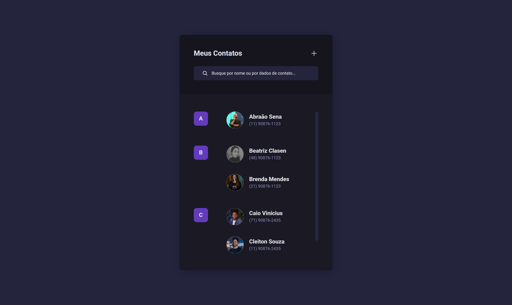

<h1 align="center"> Lista de contatos - BoraCodar#16 </h1>

[Clique aqui para acessar](https://maik-emanoel.github.io/my-contacts/)

## 🚀 Tecnologias

Esse projeto foi desenvolvido com as seguintes tecnologias:

- HTML
- CSS
- JavaScript
- Git and GitHub

## 💻 Projeto

Este projeto é uma interface de uma lista de contatos. 

Projeto construído a partir do layout proposto no desafio [#BoraCodar16](https://boracodar.dev/) realizado pela [Rocketseat](https://rocketseat.com.br).
Após o desenvolvimento do projeto inicial, adicionei novas features, tais quais:

- Layout para dispositivo com telas maiores
- Filtragem de contatos
- Opção de adicionar e excluir contatos
- Função para adicionar foto, nome e número aos novos contatos
- Efeitos hover
- Entre outras pequenas modificações.

## 🔖 Layout

Você pode visualizar o layout do projeto proposto através [DESSE LINK](https://www.figma.com/community/file/1230513627011474566). É necessário ter conta no [Figma](https://figma.com) para acessá-lo.